# 2. Despliegue

A continuación se trabajará en varios laboratorios que nos permitirán conocer las alternativas para realizar el despliegue de aplicaciones sobre Openshift, puede existir la posibilidad de desplegar imágenes Docker o incluso Usar mecanismo como S2I (Source to Image) para generar nuestras propias  imágenes a partir de nuestro código fuente. 

## 2.1 Creación de un proyecto

A continuación se describen los pasos necesarios para la creación de un proyecto en Openshift.


* Autenticarse en la consola web de Openshift.
* Openshift proporciona dos vistas en la Consola Web (**Administrator** y **Developer**), Seleccionaremos la vista de Developer.
* Para crear un nuevo proyecto se debe seleccionar el combo **Project** y dar clic en **Create Project**, se deben diligenciar los campos **Name**, **Display Name** y **Description**. Para este caso vamos a crear un proyecto llamado nexus que nos servirá como base para un paso posterior. Es importante tener en cuenta que el nombre del proyecto debe ser único para cada cluster. Si varios usuarios van a trabajar en el mismo ambiente se debe asegurar que los nombre de los proyectos sean diferentes. Se sugiere colocar como sufijo el nombre el usuario autenticado.

Ejemplo: si mi usuario es user1, el nombre del  proyecto debe quedar como nexus-**user1**. 
 


* Dar clic en **Create** 


## 2.2 Desplegar Imagen Docker
Para el siguiente ejercicio vamos a desplegar mediante la consola web una aplicación a partir de una imagen docker que está disponible en docker hub.

* Ubicarse en el proyecto previamente creado.


* Seleccionar la opción **Container Image**

* En el campo **Image name from external registry** diligenciar *sonatype/nexus*
* En la sección **Resources** se debe dejar seleccionado **Deployment Config** 
* Se debe dejar marcado el check *Create a route to the application* para que se cree la ruta que nos permitirá acceder al nexus. Se espera que los campos queden diligenciados de la siguiente manera:
  
   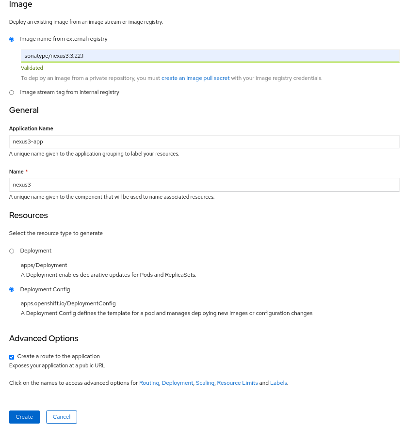
   

* Dar clic en **Create**. Seremos redirigidos a la pantalla **Topology** e iniciará el proceso de despliegue de la imagen.
 
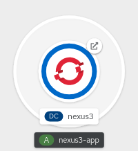


* Al dar clic sobre la aplicación aparecerá un panel en la parte derecha con 3 Tabs **Details**, **Resources** y **Monitoring**, sobre el tab de **Resources** vemos el pod que está en estado Running. Dar clic sobre el vínculo **View logs**
 Se debe esperar hasta ver en los logs un mensaje que nos indique la Nexus ya inició.
 
 

 
* Volvemos a la Opción **Topology** y damos clic en la fecha superior derecha de la aplicación.


* Seremos redirigidos a la url de Nexus. Al analizar la url vemos que esta formada por el nombre de la aplicación, nombre del projecto y el nombre del cluster.

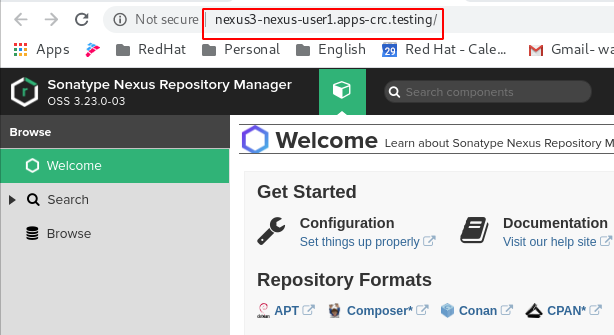


## 2.2 Despliegue de Aplicación desde el Código fuente y por template .

Para el siguiente ejercicio vamos a desplegar un APi Rest construido en Spring Framework. Para este caso Openshift construirá la imagen a partir de nuestro código fuente y procederá a desplegarlo. Para este fin usaremos un template de Openshift llamado "OpenJDK".

* Crear un nuevo proyecto en Openshift llamado *apps-"#USERNAME#*, en mi caso el campo **Name** quedaria con el valor *apps-user1* los campos **Display Name** y **Description** pueden ser diligenciados con cualquier valor.
* Dar clic en **+Add** y posteriormente seleccionar **From Catalog**

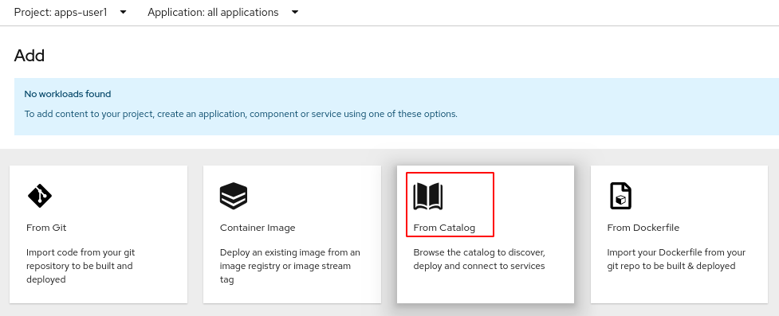


* En la caja de búsqueda colocar la palabra *OpenJdk*,  dar clic en buscar y seleccionar el template OpenJDK.


* Dar clic en **Instantiate Template**  
* El sistema nos mostrará una pantalla con campos que debemos diligenciar de la siguiente manera:
    * En el campo **Java Version**  debemos colocar el valor *8*. Esto indica la versión del JDK. El template nos indica que los posibles valores son 8, 11 y latest y que corresponden a los tags del Image Stream.
    * En el campo **Git Repository URL** debemos diligenciar con el valor *https://github.com/wilmeraguilera/lab-openshift*. Esta url corresponde a este mismo repositorio en el cual en el subdirectorio backend-users tenemos las fuentes del Api Rest.
    * En el campo **Context Directory** vamos a colocar el valor *backend-users* que corresponde al subdirectorio donde están las fuentes.
    * Los demás campos se pueden dejar iguales. Se espera que la pantalla quede de la siguiente manera:
    
    
    
* Dar clic en **Create**. 
* Con el paso anterior se crearán una serie de recursos en Openshift como el ImageStream, BuildConfig, DeploymentConfig, Service y Route.
* Dado que le entregamos a Openshift las fuentes de la aplicación, el paso que se ejecutará será el Build de la aplicación y posteriormente del Deploy. Vamos a la pantalla **Topology**, damos clic sobre la aplicación para ver el detalle y veremos que está corriendo el Build.
* Dar clic en View Logs y se evidencia que está se está ejecutando la compilación del proyecto. Este proceso tardará un poco de acuerdo a la cantidad de dependencias que deban ser descargadas y el tiempo de construcción de la imagen.


* Cuando el Build termina debemos ver una salida en los logs similar a la siguiente imagen. Note que al final del log sale el mensaje **Push Sucessfull**, esto nos indica que la compilación de la imagen ya terminó y fue almacenada en el registry de openshift. 

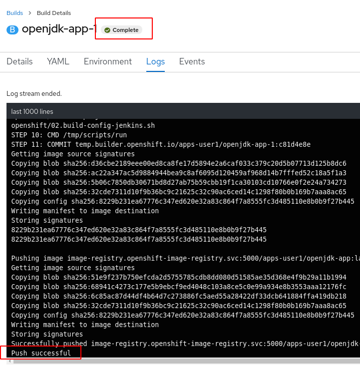

* Luego vamos a ver que se crea un pod asociado al despliegue del API Rest cuyo estado debe ser **Running**. Al dar clic en **View Logs** vamos a evidenciar que inició la aplicación Spring por el puerto 8080.

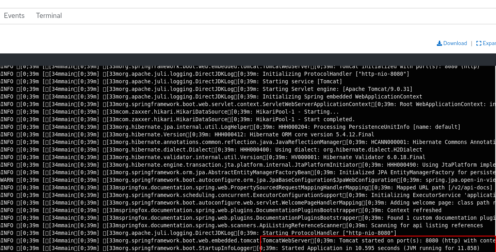

* Ir a **Topology** y sobre la aplicación hay una flecha en la parte superior derecha que nos permite ir a la ruta de la aplicación. Dar clic.

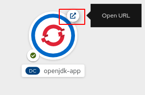

* Se abre una ventana Swagger de la API desplegada.

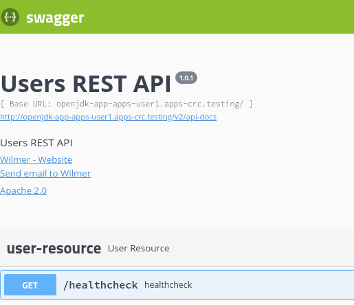


## 2.3 Despliegue aplicación desde código fuente desde el cliente oc

Openshift proporciona un mecanismo de despliegue que permite la generación de imágenes a partir del código fuente de nuestra aplicación + una imagen base.
En este caso Openshift se encargará del proceso de compilación y luego toma los binarios generados, los integra a la imagen base y así se genera una nueva imagen con nuestra Aplicación.

Para el caso de nuestra aplicación de ejemplo es posible ejecutar el comando __new-app__ para lanzar el proceso Source2Image. Nuestra aplicación utiliza maven como framework de gestión de proyectos maven el cual requiere descargar las dependencias para realizar el proceso de compilación y empaquetado de nuestra aplicación.

El build config por defecto obtendrá las dependencias de los repositorios maven de internet, sin embargo es posible configurar un repositorio de artefactos para mejorar la velocidad de la compilación ya que se evita obtener las dependecias desde Internet.
Para realizar este procedimiento se puede configurar la siguiente variable de entorno en el BuildConfig.

MAVEN_MIRROR_URL=<<url repositorio de artefactos>>
	
La anterior variable de entorno del build puede ser especificada en el comando new-app.
A continuación se muestra el comando para la creación de la aplicación involucrando los aspectos mencionados:

Nota: Reemplazar el valor del repositorio nexus con la url de su ambiente de nexus. Ver punto 2.2

```
oc new-app openshift/java:8~https://github.com/wilmeraguilera/lab-openshift/ --context-dir=backend-users --strategy=source --build-env MAVEN_MIRROR_URL=http://#{route-nexus}/repository/maven-public/
```

En el comando anterior se hace uso de una imagen base con JDK 1.8 que se encuentra dentro del namespace llamado openshift, corresponde a la parte del comando con el siguiente texto  __openshift/java__ 

Para visualizar los logs del Build se puede ejecutar el siguiente comando.

```
oc logs -f bc/lab-openshift
```

Para que la aplicación quede expuesta fuera del cluster es necesario exponer la ruta, este procedimiento se puede realizar con el siguiente comando:

```
oc expose svc lab-openshift
```

Para obtener el nombre de la ruta generada ejecutar el siguiente comando:

```
oc get route lab-openshift
``` 

Debería obtener una salida del comando similar a la siguiente:
```shell script
$ oc get route lab-openshift
NAME            HOST/PORT                                   PATH   SERVICES        PORT       TERMINATION   WILDCARD
lab-openshift   lab-openshift-apps-user1.apps-crc.testing          lab-openshift   8080-tcp                 None

```

Tomar la ruta que en mi caso es http://lab-openshift-apps-user1.apps-crc.testing en un navegador. Debemos ver la pantalla de swagger del api.

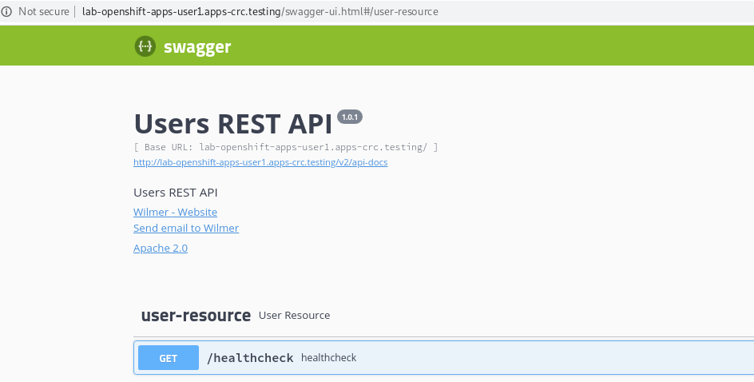

Con este se termina este laboratorio, proceder a eliminar los recursos de esta aplicación.

Existe la posibilidad de eliminar todos los recursos creados para la aplicación con la ejecución del siguiente comando que hace uso del label app=lab-openshift para buscar y eliminar los recursos. 

```
oc delete all -l app=lab-openshift
```


## 2.4 Replicas y Recuperación 

Las cosas pueden ir mal con nuestra aplicación o por motivo externos, y por eso tenemos replicación y recuperación.
Podemos planificar estas fallas y mitigarlas con la implementación de ciertas estrategias dentro de Openshift.

### Replicación

Openshift permite realizar replicación de nuestros pods o lo que es lo mismo  "Escalar  horizontalmente" nuestras aplicaciones.
Esto permite recuperarnos rapidamente de una falla de un pod  y un equilibro de la carga adecuado entre los pods disponibles.

A continuación veremos como configurar replicas en Openshift con la aplicación desplegada en el numeral 2.2
* Vaya a la vista de __Topology__ y de clic en la aplicación openjdk-app.
* En la pestana de __Details__ puede observar que tenemos un pod en ejecución.

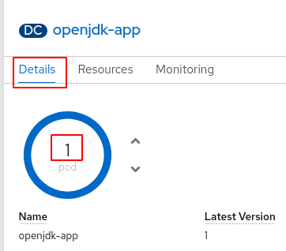

* De clic en la fecha hacia arriba para escalar de 1 pod a 3 pods.
* Vaya a la pestaña de __Resources__ y observará 3 Pods Activos.

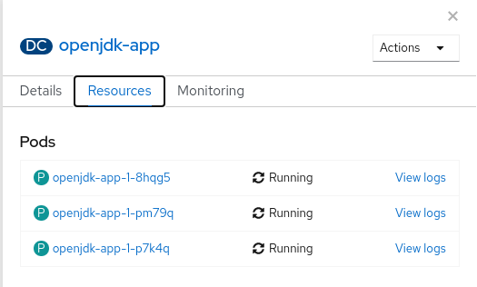

* Si da clic en la ulr de la ruta observará que el comportamiento de la aplicación o ha cambiado (El api permanece desplegado). Con esta configuración el trafico será balanceado por el __Service__ entre los 3 pods activos.

### Recuperación

En el ejercicio anterior tenemos nuestra aplicación atendiendo peticiones con 3 Pods, en el caso de que un pod fallé Openshift creará uno nuevo de manera automática.

Podemos ver esté comportamiento pero debemos ejecutar las acciones rapidamente para lograr ver la creación de la nueva replica.

* Navega hasta la vista de __Topology__ y haga clic sobre la aplicación openjdk-app.
* En el tab __Resources__ selecciona uno de los pods activos.
* Ya dentro del pod en el menú de acciones (__Actions__) vamos a eliminar el pod dando clic en __Delete Pod__ y confirmamos la eliminación.
* Rapidamente vaya a __Topology__, seleccione la aplicación y si fué lo suficientemente rápido en el tab de __Resources__ observará que un pod está siendo eliminado y otro se está creando.
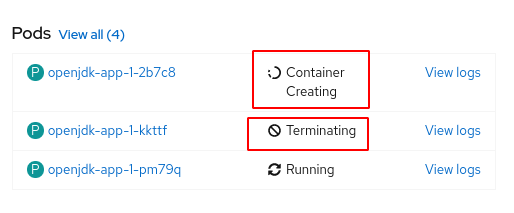
* Si desea repita el ejercicio para ver el comportamiento. 
 

 
  


