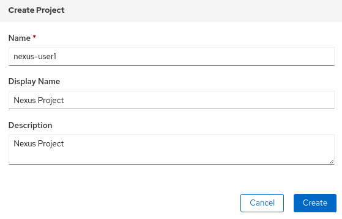
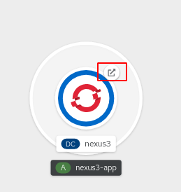
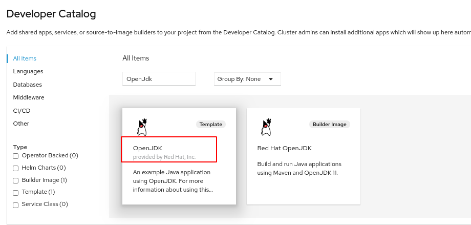
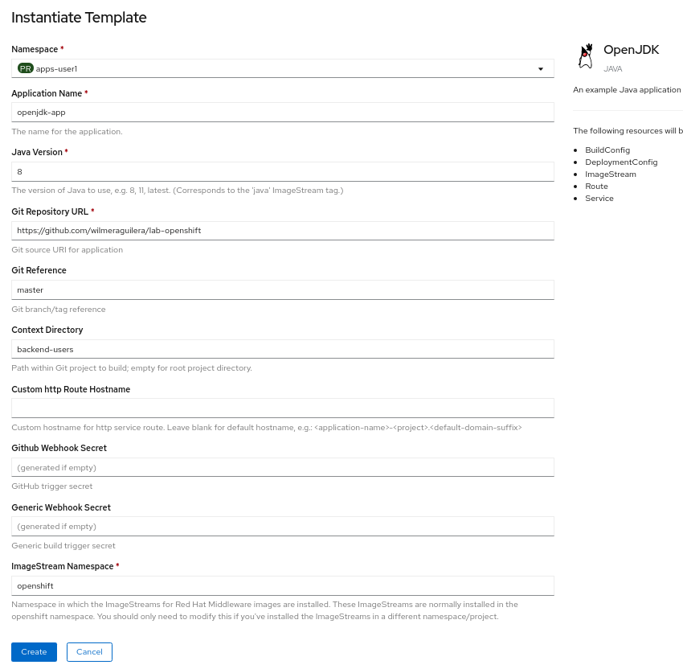

# 2. Despliegue

A continuación se trabajará en varios laboratorios que nos permitirán conocer las alternativas para realizar el despliegue de aplicaciones sobre Openshift, puede existir la posibilidad de desplegar imagenes Docker o incluso Usar mecanismo como S2I (Source to Image) para generar nuestras propias  imágenes a partir de nuestro código fuente. 

## 2.1 Creación de un proyecto

A continuación se describen los pasos necesarios para la creación de un proyecto en Openshift.


* Autenticarse en la consola web de Openshift.
* Openshift proporciona dos vistas en la Consola Web (**Administrator** y **Developer**), Seleccionaremos la vista de Developer.
* Para crear un nuevo proyecto se debe seleccionar el combo **Project** y dar clic en **Create Project**, se deben diligenciar los campos **Name**, **Display Name** y **Description**. Para este caso vamos a crear un proyecto llamado nexus que nos servirá como base para paso posterior. Es importante tener en cuenta que el nombre del proyecto debe ser único para cada cluster. Si varios usuarios van a trabajar en el mismo ambiente se debe asegurar que los nombre de los proyectos sean diferentes. Se sugiere colocar como sufijo el nombre el usuario autetnocato.

Ejemplo: si mi usuario es user1, el nombre del  proyecto debe quedar como nexus-**user1**. 
 



* Dar clic en **Create** 


## 2.2 Desplegar Imagen Docker
Para el siguiente ejercicio vamos a desplegar mediente la consola web una aplicación a partir de una imagen docker que está disponible en docker hub.

* Ubicarse en el proyecto previamente creado.


* Seleccionar la opción **Container Image**

* En el campo **Image name from external registry** diligenciar *sonatype/nexus*
* En la sección **Resources** se debe dejar seleccionado **Deployment Config** 
* Se debe dejar marcado el check *Create a route to the application* para que se cree la ruta que nos permitirá acceder al nexus. Se espera que los campos queden diligenciados de la siguiente manera:
  
   
   

* Seremos redirigidos a la pantalla **Topology** e iniciará el proceso de despliegue de la imagen.
 


* Al dar clic sobre la aplicación aparecerá un panel en la parte derecha con 3 Tabs **Details**, **Resources** y **Monitoring**, sobre el tab de **Resources** vemos el pod que está en estado Running. Dar clic sobre el vínculo **View logs**
 Se debe esperar haste ver en los logs un mensaje que nos indique la Nexus ya inició.
 
 

 
* Volvemos a la Opción **Topology** y damos clic en la fecha superior derecha de la aplicación.



* Seremos redirigidos a la url de Nexus. Al analizar la url vemos que esta formada por el nombre de la aplicación, nombre del projecto y el nombre del cluster.


## 2.2 Despliegue de Aplicación desde el Código fuente y por template .

Para el siguiente ejercicio vamos a desplegar un APi Rest construido en Spring Framework. Para este caso Openshift construirá la imagen a partir de nuestro código fuente y procederá a desplegarlo. Para este fin usaremos un template de Openshift llamado "OpenJDK".

* Crear un nuevo proyecto en Openshift llamado *apps-"#USERNAME#*, en mi caso el campo **Name** quedaria con el valor *apps-user1* los campos **Display Name** y **Description** pueden ser diligenciados con cualquier valor.
* Dar clic en **+Add** y posteriormente seleccionar **From Catalog**


* En la caja de búsqueda colocar la palabra *OpenJdk*,  dar clic en buscar y seleccionar el template OpenJDK.



* Dar clic en **Instantiate Template**  
* El sistema nos mostrará una pantalla con campos que debemos diligenciar de la siguiente manera:
    * En el campo **Java Version**  debemos colocar el valor *8*. Esto indica la versión del JDK. El template nos indica que los posibles valores son 8, 11 y latest y que corresponden a los tags del Image Stream.
    * En el campo **Git Repository URL** debemos diligenciar con el valor *https://github.com/wilmeraguilera/lab-openshift*. Esta url corresponde a este mismo repositorio en el cual en el subdirectorio backend-users tenemos las fuentes del Api Rest.
    * En el campo **Context Directory** vamos a colocar el valor *backend-users* que corresponde al subdirectorio donde están las fuentes.
    * Los demás campos se pueden dejar iguales. Se espera que la pantalla quede de la siguiente manera:
    
    
    
* Dar clic en **Create**. 
* Con el paso anterior se crearan una serie de recursos en Openshift entro lo que estan el ImageStream, BuildConfig, DeploymentConfig, Service y Route.
* Dado que le entregamos a Openshift las fuentes de la aplicación, el paso que se ejecutará será el Build de la aplicación. Vamos a la pantalla **Topology**


      


## Despliegue aplicación desde código fuente desde el cliente oc

Openshift proporciona un mecanismo de despliegue que permite la generación de imagenes a partir del código fuente de nuestra aplicación + una imagen base.
En este caso Openshift se encargará del proceso de compilación y luego toma los binarios generados, los integra a la imagen base y así se genera una nueva imagen con nuestra App.

Para el caso de nuestra aplicación de ejemplo en la cual usamos maven, openshift requiere de acceso a internet para la descarga de las dependencias.

A continuación se muestra el comando para la creación de la aplicación:

```
oc new-app openshift/openjdk18-openshift:latest~https://github.com/wilmeraguilera/lab-openshift/ --context-dir=backend-users --strategy=source
```

En el comando anterior se hace uso de una imagen base con JDK 1.8 que ha sido previamente importada en Openshift, corresponde a la parte del comando con el siguiente texto  __openshift/openjdk18-openshift__ 

Para visualizar los logs del Build se puede ejecutar el siguiente comando.

```
oc logs -f bc/lab-openshift
```

El build config en este caso obtendrá las dependencias de los repositorios maven de internet, sin embargo es posible configurar un repositorio de artefactos para mejor la velocidad de la compilación.

Para realizar este procedimiento se puede configurar la siguiente variable de entorno en el BuildConfig.

MAVEN_MIRROR_URL=<<url repositorio de artefactos>>
	
La anterior variable de entorno del build tambien puede ser especificada en el comando new-app

```
oc new-app openshift/openjdk18-openshift:latest~https://github.com/wilmeraguilera/lab-openshift/ --context-dir=backend-users --strategy=source --build-env MAVEN_MIRROR_URL=http://nexus3-nexus.192.168.42.130.nip.io/repository/maven-public/
```


## Docker

Openshift permite la Openshift da la posibilidad de trabajar con Imágenes docker como base para nuestras aplicaciones,  y también el desarrollador tiene la posibilidad de crear nuevas imágenes para sus aplicaciones a partir de archivos Dockerfile personalizados.

Para generar las imágenes mediente un archivo Dockerfile se debe crear un Build Configuración de tipo binario y cuya estrategia sea Docker. Posteriormente se debe lanzar el Build y enviar los archivos binarios requeridos para la construcción de la imagen.


Al momento de iniciar el build se deben enviar los archivos requeridos para la construcción de la imagen.

A nivel de argumentos se tienen las siguientes posibilidades:

- (--from-file)
- (--from-directory)
- (--from-archive)
- (--from-repo)


Comando para crear el Build de tipo Binario y con strategia Docker. Debe exitir en la raiz del proyecto el archivo de docker con el siguiente nombre  ```Dockerfile```

```
oc new-build --strategy docker --binary --name myapp
```

Comando para iniciar el Build enviando como parámetro el directorio de los fuentes y binarios del proyecto. Debo estar ubicado en el directorio del proyecto el cual deseo sea referenciado en el Build.

```
oc start-build myapp --from-dir=.
```

Con el comando anterior lograremos tener una imagen con nuestra aplicación almacenad en el registro interno de oopenshift y se generará el ImageStream referenciandola.
Con el siguiente comando podremos crear la aplicación a partir de dicha imagen.

```sh
oc new-app dev-api-users-docker/lab-openshift --name myapp
```


## Fabric8

Fabric8 es una herramienta que busca facilitar el ciclo de vida de las aplicaciones, con esta utilidad es posible compilar, probar y desplegar nuestras aplicaciones en Openshift o Kubernetes.

Para realizar el uso de esta utilidad dentro de nuestras aplicaciones existe un plugin de maven que debemos agregar y con un par de configuraciones lograremos realizar los despliegues en Openshift.


Realizar la compilación del proyecto de manera local mediente el uso de maven.

```
mvn install
```

Debemos ver una salida en consola que nos indique que la compilación fué satisfactoria, deberia ser similar a la siguiente:

```
/home/wilmeraguilera/.m2/repository/com/redhat/backend-users/0.0.1-SNAPSHOT/backend-users-0.0.1-SNAPSHOT.jar
[INFO] Installing /home/wilmeraguilera/git/lab-openshift/backend-users/pom.xml to /home/wilmeraguilera/.m2/repository/com/redhat/backend-users/0.0.1-SNAPSHOT/backend-users-0.0.1-SNAPSHOT.pom
[INFO] ------------------------------------------------------------------------
[INFO] BUILD SUCCESS
[INFO] ------------------------------------------------------------------------
[INFO] Total time:  8.405 s
[INFO] Finished at: 2020-03-11T16:59:44-05:00
[INFO] ------------------------------------------------------------------------
```

Revisar el pom.xml y analizar la definición del plugin de fabric8-maven-plugin

```
<plugins>
	<plugin>
		<groupId>org.springframework.boot</groupId>
		<artifactId>spring-boot-maven-plugin</artifactId>
	</plugin>
	<plugin>
		<groupId>io.fabric8</groupId>
		<artifactId>fabric8-maven-plugin</artifactId>
		<version>4.4.0</version>
	</plugin>
</plugins>
```

En dicho archivo tambien está definido un profile de maven que nos permite que las fases de fabric8 se vinculen 
a las fases de maven. De esta manera se logra que al ejecutar `mvn install ` se ejecuten la tareas `resource build deploy`


```
<profiles>
	<profile>
	<id>openshift</id>
	<build>
		<plugins>
			<plugin>
				<groupId>io.fabric8</groupId>
				<artifactId>fabric8-maven-plugin</artifactId>
				<executions>
					<execution>
						<id>fmp</id>
						<goals>
							<goal>resource</goal>
							<goal>build</goal>
						</goals>
					</execution>
				</executions>
			</plugin>
		</plugins>
	</build>
</profile>
```

Para hacer uso de fabric8 para el despliegue en openshift es necesario estar auntenticados con el cliente oc y ubicarnos en el proyecto donde deseamos se realice el despliegue de la aplicación.

Para crear un nuevo proyecto en openshift debemos ejecutar el siguiernte comando.

```
oc new-project dev-api-rest-f8
```

Para seleccionar un proyecto existente debemos ejecutar el comando `oc project dev-api-rest-f8`

Para lanzar la compilación y tambien ejecutar los procesos de Fabric8 (resource, build y deploy), se debe ejecutar el siguiente comando.


```
mvn fabric8:deploy -P openshift 
```

Con este comando se debe realizar la construcción de la imagen y despliegue de la app en openshift.


