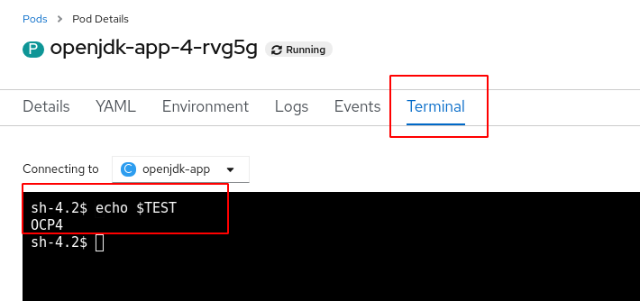

## 3 ConfigMaps y Secrets

### Variables de entorno.

Las variables de configuración de nuestras aplicaciones pueden ser definidas en variables de entorno. En el siguiente ejercicio vamos a configurar una variable de entorno en el __DeploymentConfig__ y vamos verificar su valor dentro del pod.

1. Ir a __Topology__ y seleccionar nuestra aplicación openjdk-app.
2. Seleccionar el tab __Details__ y en el menu de acciones seleccionar __​Edit Deployment Config__. El recurso __Deployment Config__ es el encargado de almacenar configuraciones asociados al despliegue de los pod de nuestra aplicación.
3. Dar clic en el Tab __Environment__
4. En esta página veras dos secciones, una primera sección permite la configuración de variables de entorno de manera manual y una segunda sección que permite la configuración desde configmaps y secrets. En este ejercicio nos enfocaremos en la primera sección.
5. Agregar la variable de entorno con nombre __TEST__ y valor __OCP4__ y dar clic en __SAVE__.
Dado que por defecto existe un Trigger asociado a cambio en la configuración , se lanzará automáticamente el despliegue justo después de guardar los cambios.


7. Vamos a __Topology__, seleccionamos la aplicación openjdk-app  y luego al tab __Resources__. Seleccionamos el pod y nos dirigimos al tab __Terminal__.
8. En la terminal ejecutamos este comando ``echo $TEST`` y debemos ver el valor previamente configurado en las variables de entorno.


  

### Config Maps

Muchas aplicaciones requieren configuraciones que se pueden realizar en archivos o variables de entorno. Una buenas partica es desacoplar estas configuraciones de nuestras imagenes para que nuestras aplicaciones sean mucho mas portables.

Para el caso de nuestro ejemplo que corresponde a una aplicación SpringBoot, a continuación se muestran los comandos que permiten la creación del configmap a partir del archivo application.properties (Archivo de configuración común en este tipo de aplicaciones).

Nos debemos ubicar en la ruta  donde está el archivo application.properties, en mi caso `/home/wilmeraguilera/git/Laboratorios/lab-openshift/complete/backend-users/src/main/resources`

Y ejecutar el siguiente comando:
```
oc create configmap myconfigmap --from-file=application.properties
```

Luego se debe montar el archivo dentro del contenedor, para hacerlo se debe ejecutar el siguiente comando que se encarga de configurar el volumen dentro del DeploymentConfig. Este cambio requiere que se despliegue de nuevo la aplicación pero por defecto se realizá automáticamente cuando cambia la configuración del DeploymentConfig.

```
oc set volume dc/lab-openshift --add --name=map-application --mount-path=/deployments/config/application.properties --sub-path=application.properties --configmap-name=myconfigmap
```


### Secrets


