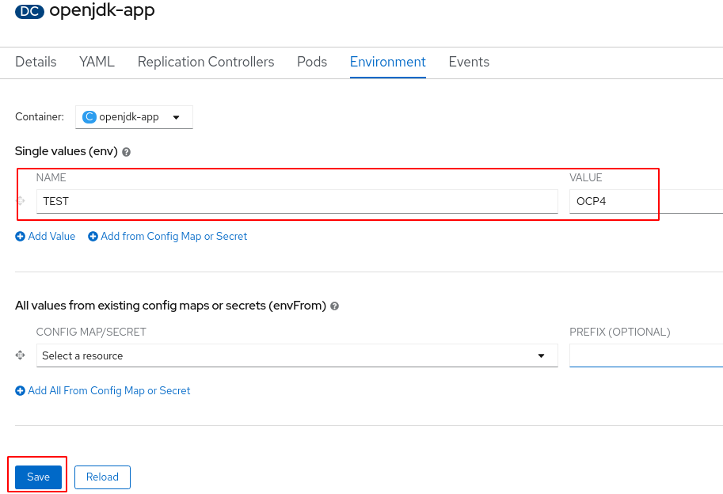
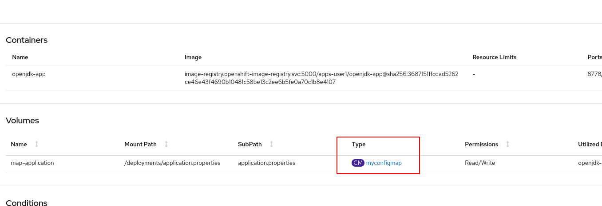
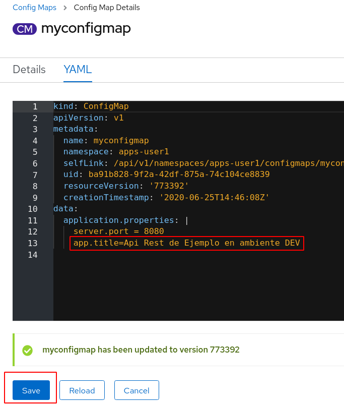

## 3 ConfigMaps y Secrets

### Variables de entorno.

Las variables de configuración de nuestras aplicaciones pueden ser definidas en variables de entorno. En el siguiente ejercicio vamos a configurar una variable de entorno en el __DeploymentConfig__ y vamos verificar su valor dentro del pod.

1. Ir a __Topology__ y seleccionar nuestra aplicación openjdk-app.
2. Seleccionar el tab __Details__ y en el menu de acciones seleccionar __​Edit Deployment Config__. El recurso __Deployment Config__ es el encargado de almacenar configuraciones asociados al despliegue de los pod de nuestra aplicación.
3. Dar clic en el Tab __Environment__
4. En esta página veras dos secciones, una primera sección permite la configuración de variables de entorno de manera manual y una segunda sección que permite la configuración desde configmaps y secrets. En este ejercicio nos enfocaremos en la primera sección.
5. Agregar la variable de entorno con nombre __TEST__ y valor __OCP4__ y dar clic en __SAVE__.
Dado que por defecto existe un Trigger asociado a cambio en la configuración , se lanzará automáticamente el despliegue justo después de guardar los cambios.



7. Vamos a __Topology__, seleccionamos la aplicación openjdk-app  y luego al tab __Resources__. Seleccionamos el pod y nos dirigimos al tab __Terminal__.
8. En la terminal ejecutamos este comando ``echo $TEST`` y debemos ver el valor previamente configurado en las variables de entorno.


  

### Config Maps

Muchas aplicaciones requieren configuraciones que se pueden realizar en archivos o variables de entorno. Una buena práctica es desacoplar estas configuraciones de nuestras imágenes mediante el uso de ConfigMaps.
Para el caso de nuestro ejemplo que corresponde a una aplicación SpringBoot, a continuación se muestran los comandos que permiten la creación del configmap a partir del archivo application.properties (Archivo de configuración común en este tipo de aplicaciones).

1. Clonar el repositorio.
```
git clone https://github.com/wilmeraguilera/lab-openshift.git
```

2. Ubicarnos en la ruta __lab-openshift/backend-users/src/main/resources__
En este folder existe un archivo llamado application.properties

3. Debemos conectarnos al cluster por medio del cliente oc y seleccionar el proyecto donde está desplegada nuestra aplicación openjdk-app.
El proyecto debe llamarse apps-#USERNAME#

4. Proceder a crear el config-map
```
oc create configmap myconfigmap --from-file=application.properties
```

5. Luego se debe montar el archivo dentro del contenedor, para hacerlo se debe ejecutar el siguiente comando que se encarga de configurar el volumen dentro del DeploymentConfig. Este cambio requiere que se despliegue de nuevo la aplicación pero por defecto se realizá automáticamente cuando cambia la configuración del DeploymentConfig.

```
oc set volume dc/lab-openshift --add --name=map-application --mount-path=/deployments/application.properties --sub-path=application.properties --configmap-name=myconfigmap
```
Dado que se modificó directamente el DeploymentConfig se lanzará el deploy automaticamente.

6. Verificar que el pod haya iniciado de nuevo. Podemos ejecutar el siguiente comando para ver los pods que están ene ejecución en el proyecto.
``oc get pods``

Deberiamos ver una salida como la siguiente:

```shell script
[wilmeraguilera@localhost resources]$ oc get pods
NAME                   READY   STATUS      RESTARTS   AGE
openjdk-app-1-build    0/1     Completed   0          26d
openjdk-app-1-deploy   0/1     Completed   0          26d
openjdk-app-2-deploy   0/1     Completed   0          21h
openjdk-app-4-deploy   0/1     Completed   0          15h
openjdk-app-5-deploy   0/1     Completed   0          25m
openjdk-app-6-deploy   0/1     Completed   0          10m
openjdk-app-7-ctj49    1/1     Running     0          16s
```

En la salida anterior podemos observar un pod que se encuentra en estado __Running__.

7. Ahora debemos conectarnos al pod por ssh, para hacer esto ejecutamos el siguiente comando con el nombre del pod que está en estado __Running__.

``oc rsh openjdk-app-7-ctj49``

8. Ya dentro del pod vamos al directorio */deployments* con el comando ``cd /deployments``
y listamos los archivos que se encuentran allí  ``ls -l``

Veremos una salida similar a esta.

```shell script
sh-4.2$ ls -l
total 43960
-rw-r--r--. 1 root 1000620000       49 Jun 25 15:16 application.properties
-rw-rw-r--. 1  185 root       45004399 May 29 21:21 backend-users-0.0.1-SNAPSHOT.jar
drwxrwxr-x. 2  185 root              6 Apr 21 11:57 data
drwxrwxr-x. 2  185 root             66 May 29 21:21 openshift
-rw-rw-r--. 1  185 root            904 May 29 21:21 settings-maven.xml
```

Allí vemos que existe un archivo llamado application.properties que fue el que acabamos de montar.
Nota: Para el caso de aplicaciones SpringBoot es posible cargar el archivo application.properties desde fuera de jar y tendrá prioridad sobre los archivos de propiedades dentro del jar. Por esta razón nuestra aplicación ya está leyendo el archivo que montamos mediante el config map.
Nuestra aplicación lee del archivo application.properties una propiedad llamada app.title y es usada por el api en la operación GET healthcheck.

9. Verificar respuesta servicio healthcheck
Obtenemos la ruta con el comando ``oc get route`` y le adicionalmente el path /healthcheck

En mi caso quedaría así:
http://openjdk-app-apps-user1.apps-crc.testing/healthcheck

Para verificar el valor debemos acceder a la url mediante el navegador o mediante curl con el siguiente comando:

```shell script
curl -X GET "http://openjdk-app-apps-user1.apps-crc.testing/healthcheck" -H "accept: */*"
```
Debemos ver una salida con el valor de la propiedad y el texto "Status UP!"

10. Modificar en el config map la propiedad  app.title del configmap.

En la consola web de openshift buscar el deployment config de nuestra aplicación, ubicarnos en el tab __Details__ y seleccionar el configmap myconfig en la sección __Volumes__.



11. Ya dentro del config map debemos ir al menu de acciones y dar clic __Edit Config Map__, colocar el valor deseado en la propiedad app.title, luego dar clic en __Save__



12. Para que tome los cambios de config map dentro de nuestra aplicación es necesario hacer un nuevo deploy (Importante tener en cuenta que no estamos cambiando la imagen de contenedor).
Para hacerlo podemos ejecutar el siguiente comando.

``oc rollout latest dc/openjdk-app``

13. Esperemos un poco a que el deploy termine y vamos de nuevo a la ruta a verificar la salida del servicio /healthcheck

Deberíamos ver una salida con el valor que configuramos. 


 

  


### Secrets


